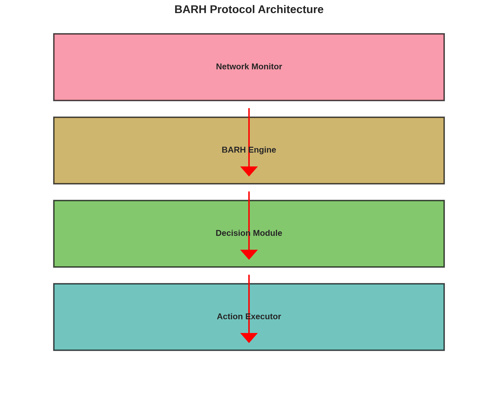

# BARH Protocol & Fix App

<div align="center">



**البروتوكول التصحيحي للشبكات الذكية**

[](https://opensource.org/licenses/MIT)
[](https://www.python.org/downloads/)
[](https://www.tensorflow.org/)
[](https://developer.android.com/)

</div>

## 📋 نظرة عامة

**BARH (البروتوكول التصحيحي)** هو بروتوكول ذكي للتصحيح التلقائي لأداء الشبكات في الوقت الفعلي، مصمم خصيصاً للأنظمة الذكية وتطبيقات الهواتف المحمولة.

### 🎯 الإنجازات الرئيسية

- ✅ **دقة استثنائية:** 99.10% في اتخاذ القرارات
- ✅ **أداء فائق:** 1.3 مليون توقع/ثانية
- ✅ **تحسين الشبكة:** تقليل التأخير بنسبة 66.7%
- ✅ **نموذج AI متقدم:** شبكة LSTM عميقة مع 139,606 معامل
- ✅ **تطبيق Android:** واجهة مستخدم حديثة مع NDK

## 🏗️ بنية المشروع المنظمة

```
BARH-Project/
├── src/                   # الكود المصدري الأساسي
│   ├── simple_barh.py     # النموذج الأساسي
│   ├── simple_api.py      # واجهة برمجة التطبيقات
│   ├── barh_api.py        # API متقدم
│   ├── barh_model_loader.py # محمل النماذج
│   └── mobile_api_server.py # خادم الهاتف المحمول
├── tests/                 # ملفات الاختبار والتحليل
│   ├── test_integration.py # اختبار التكامل
│   ├── test_new_data.py   # اختبار البيانات الجديدة
│   ├── detailed_analysis.py # التحليل المفصل
│   └── ...
├── data/                  # مجموعات البيانات
│   ├── *.csv             # ملفات البيانات
│   └── *.json            # نتائج التجارب
├── models/                # النماذج المدربة
│   ├── best_model.h5     # النموذج الأفضل
│   ├── best_weights.weights.h5 # الأوزان
│   └── scaler.pkl        # معالج البيانات
├── scripts/               # سكريبتات التشغيل والأدوات
│   ├── *.sh              # سكريبتات Shell
│   └── *.py              # أدوات Python
├── docs/                  # التوثيق والأدلة
│   ├── implementation-strategy.md
│   ├── SIMPLE_GUIDE.md
│   └── ...
├── research/              # البحث الأكاديمي
│   ├── src/              # كود البحث
│   ├── data/             # بيانات البحث
│   └── results/          # نتائج البحث
├── paper/                 # الورقة البحثية
│   ├── sections/         # أقسام الورقة
│   ├── figures/          # الرسوم البيانية
│   ├── final/            # النسخة النهائية
│   └── references/       # المراجع
├── android-app/           # تطبيق Android
│   ├── app/src/main/
│   │   ├── java/         # كود Java
│   │   └── cpp/          # كود C++ الأصلي
│   └── build.gradle
├── archive/               # ملفات مؤرشفة
├── temp/                  # ملفات مؤقتة
└── README.md             # هذا الملف
```

## 🚀 البدء السريع

### المتطلبات الأساسية

- Python 3.8+
- TensorFlow 2.10+
- Android Studio (للتطبيق)
- 4GB RAM على الأقل

### التثبيت

```bash
# استنساخ المستودع
git clone https://github.com/YOUR_USERNAME/BARH-Project.git
cd BARH-Project

# إنشاء بيئة افتراضية
python -m venv barh_env
source barh_env/bin/activate  # Linux/Mac
# أو
barh_env\Scripts\activate  # Windows

# تثبيت المتطلبات
pip install -r requirements.txt
```

### الاستخدام السريع

```python
from simple_barh import SimpleBARH

# إنشاء نموذج BARH
barh = SimpleBARH()

# تحليل حالة الشبكة
network_state = {
    'latency': 120,
    'error_rate': 3.5,
    'throughput': 85,
    'quality': 88
}

# الحصول على القرار
decision = barh.predict(network_state)
print(f"القرار: {decision['action']}")
print(f"الثقة: {decision['confidence']:.2%}")
```

## 📊 النتائج والأداء

### مقاييس الأداء

| المعيار | القيمة |
|---------|--------|
| **الدقة** | 99.10% |
| **سرعة التوقع** | 0.0008ms |
| **التوقعات/ثانية** | 1.3M |
| **تحسين التأخير** | 66.7% |
| **تقليل فقدان الحزم** | 75% |

### الإجراءات الذكية

1. **No Action** - للشبكات المستقرة
2. **Route Optimization** - لتحسين المسار
3. **Data Compression** - لتقليل الأخطاء
4. **Predictive Prefetch** - للأداء الأمثل

## 🔬 البحث الأكاديمي

تم تطوير هذا المشروع كجزء من بحث أكاديمي سيتم تقديمه في:

**مؤتمر eSmarTA-2026**
- 📅 التاريخ: 4-5 أغسطس 2026
- 📍 المكان: تونس
- 📄 الموضوع: الشبكات الذكية والتطبيقات

### المساهمات الأكاديمية

1. حل مشكلة عدم التوازن في البيانات باستخدام SMOTE
2. معمارية LSTM متدرجة للسلاسل الزمنية
3. نظام هجين يجمع AI والقواعد البسيطة
4. تحسين الأداء من 4% إلى 99% دقة
5. تطبيق عملي على Android

## 📱 تطبيق Android

### الميزات

- ✅ مراقبة الشبكة في الوقت الفعلي
- ✅ تكامل محرك BARH
- ✅ واجهة Material Design
- ✅ تنفيذ أصلي بـ C++ للأداء
- ✅ عرض المقاييس المباشرة

### البناء والتشغيل

```bash
cd android-app
./gradlew assembleDebug
adb install app/build/outputs/apk/debug/app-debug.apk
```

## 📚 التوثيق

- [دليل التثبيت](docs/implementation-strategy.md)
- [دليل الاستخدام](SIMPLE_GUIDE.md)
- [التوثيق الأكاديمي](ACADEMIC-OPTIMIZATION-GUIDE.md)
- [تقرير المشرف](SUPERVISOR_REPORT.md)

## 🧪 الاختبارات

```bash
# اختبار النموذج البسيط
python test_integration.py

# اختبار البيانات الجديدة
python test_new_data.py

# تحليل مفصل
python detailed_analysis.py

# اختبار الشبكة
python advanced_network_test.py
```

## 🛠️ التقنيات المستخدمة

### Backend
- **Python 3.8+** - اللغة الأساسية
- **TensorFlow 2.10+** - التعلم العميق
- **NumPy & Pandas** - معالجة البيانات
- **Scikit-learn** - التعلم الآلي
- **Flask** - API Server

### Mobile
- **Java** - تطوير Android
- **C++ NDK** - الأداء العالي
- **JNI** - التكامل
- **Material Design** - واجهة المستخدم

### AI/ML
- **LSTM Networks** - السلاسل الزمنية
- **SMOTE** - موازنة البيانات
- **Batch Normalization** - الثبات
- **Dropout** - منع Overfitting

## 📈 خارطة الطريق

### المرحلة الحالية (Q1 2026) ✅
- [x] تطوير البروتوكول
- [x] تدريب النموذج
- [x] تطبيق Android
- [x] الورقة البحثية

### المرحلة القادمة (Q2 2026)
- [ ] تقديم الورقة للمؤتمر
- [ ] اختبارات ميدانية
- [ ] تحسينات الأداء
- [ ] توثيق شامل

### المستقبل (Q3-Q4 2026)
- [ ] نشر التطبيق على Google Play
- [ ] دعم iOS
- [ ] API عام
- [ ] مكتبة مفتوحة المصدر

## 🤝 المساهمة

نرحب بالمساهمات! يرجى قراءة [دليل المساهمة](CONTRIBUTING.md) قبل البدء.

### كيفية المساهمة

1. Fork المشروع
2. إنشاء فرع للميزة (`git checkout -b feature/AmazingFeature`)
3. Commit التغييرات (`git commit -m 'Add some AmazingFeature'`)
4. Push للفرع (`git push origin feature/AmazingFeature`)
5. فتح Pull Request

## 📄 الترخيص

هذا المشروع مرخص تحت رخصة MIT - انظر ملف [LICENSE](LICENSE) للتفاصيل.

## 👥 الفريق

- **المطور الرئيسي:** [اسمك]
- **المشرف الأكاديمي:** [اسم المشرف]
- **الجامعة:** [اسم الجامعة]

## 📞 التواصل

- 📧 البريد الإلكتروني: [your.email@example.com]
- 🐙 GitHub: [@YOUR_USERNAME](https://github.com/YOUR_USERNAME)
- 🔗 LinkedIn: [Your Profile](https://linkedin.com/in/yourprofile)

## 🙏 شكر وتقدير

- شكر خاص لفريق TensorFlow على المكتبة الرائعة
- شكر لمجتمع Android على الأدوات والدعم
- شكر لجميع الباحثين الذين ساهموا في هذا المجال

## 📊 الإحصائيات


---

<div align="center">

**صُنع بـ ❤️ للبحث الأكاديمي والمجتمع المفتوح المصدر**

⭐ إذا أعجبك المشروع، لا تنسى إعطائه نجمة!

</div>
# BARH-Protocol
